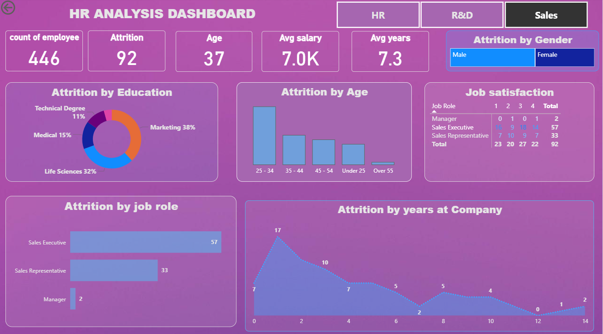

# 📊 HR Analytics Dashboard

## 📌 Project Overview
The HR Analytics Dashboard is an interactive Power BI project designed to analyze employee attrition, workforce demographics, job satisfaction, and key HR metrics. The dashboard helps HR teams and business leaders identify patterns affecting employee retention and make data-driven workforce decisions.

---

## 🎯 Objectives
- Analyze employee attrition trends
- Monitor workforce demographics
- Understand job satisfaction levels
- Identify high-risk attrition groups
- Support HR decision-making through visual insights

---

## 🛠️ Tools & Technologies
- Power BI
- Microsoft Excel
- Data Modeling
- Data Visualization
- HR Analytics

---

## 📈 Key Performance Indicators (KPIs)
- 👥 Total Employee Count
- 🚪 Attrition Count
- 🎂 Average Employee Age
- 💰 Average Monthly Income
- 📅 Average Years at Company

---

## 📊 Dashboard Insights

### 1. Attrition by Education Field
- Donut Chart
- Identifies education backgrounds with higher attrition

### 2. Attrition by Age Group
- Column Chart
- Shows employee turnover across age groups

### 3. Attrition by Job Role
- Bar Chart
- Highlights high attrition job roles

### 4. Job Satisfaction Analysis
- Matrix/Table
- Compares satisfaction levels across roles

### 5. Attrition by Gender
- Treemap
- Gender-wise attrition distribution

### 6. Attrition by Years at Company
- Line Chart
- Retention patterns over time

### 7. Department Filter
- Interactive slicer for filtering analysis

---

## 📷 Dashboard Preview

### HR Analytics Dashboard



---

## 🔍 Business Insights
- Identify departments with high employee turnover
- Analyze retention trends
- Understand workforce demographics
- Improve HR strategies using data-driven decisions
- Support talent retention initiatives

---

## 🚀 Future Improvements
- Predictive Attrition Analysis
- Employee Performance Analytics
- Hiring & Recruitment Dashboard
- Diversity & Inclusion Metrics
- Advanced HR KPI Tracking

---

## 📂 Repository Structure

```
HR_Analytics/
│
├── README.md
├── HR_Analytics.pbix
├── HR Data.xlsx - HR data.csv
└── hr_dashboard.png
```

---

## 👩‍💻 Author

**Simran Bhasin**

Aspiring Data Analyst | SQL • Python • Power BI • Excel

📧 Email: simranbhasin310@gmail.com  
💼 LinkedIn: https://www.linkedin.com/in/simranbhasin310  
📷 Instagram: https://www.instagram.com/itzz.simran._  
🐙 GitHub: https://github.com/simranbhasin310  

---

## ⭐ Project Goal
Transform HR data into actionable insights that improve employee retention, workforce planning, and business decision-making.
